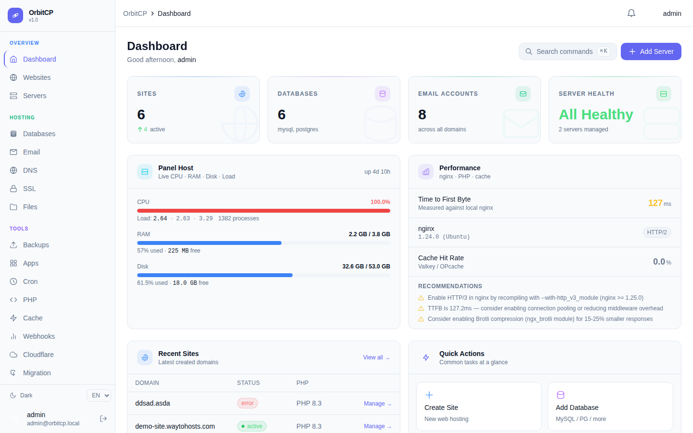
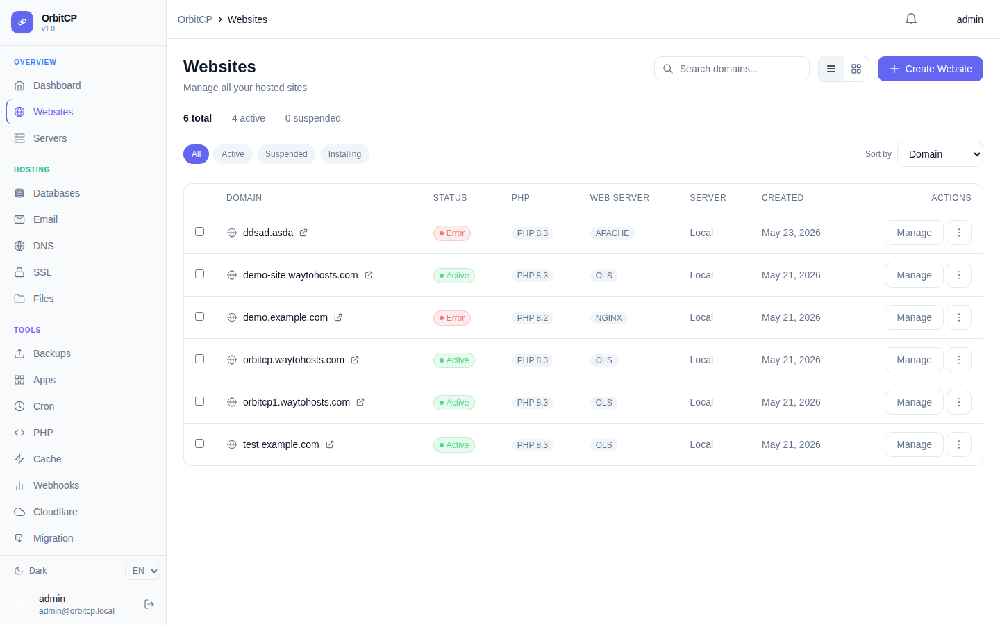
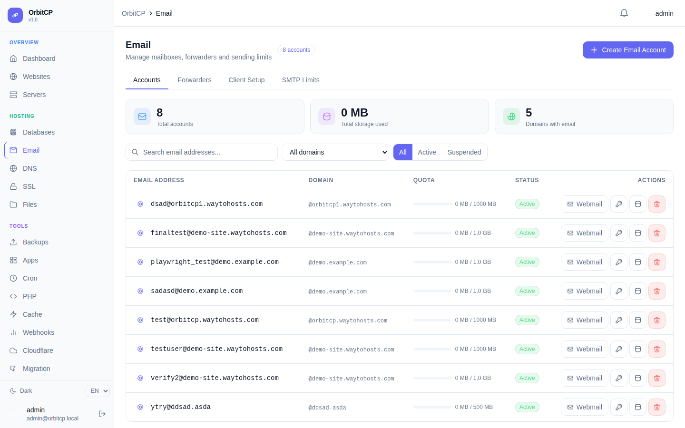
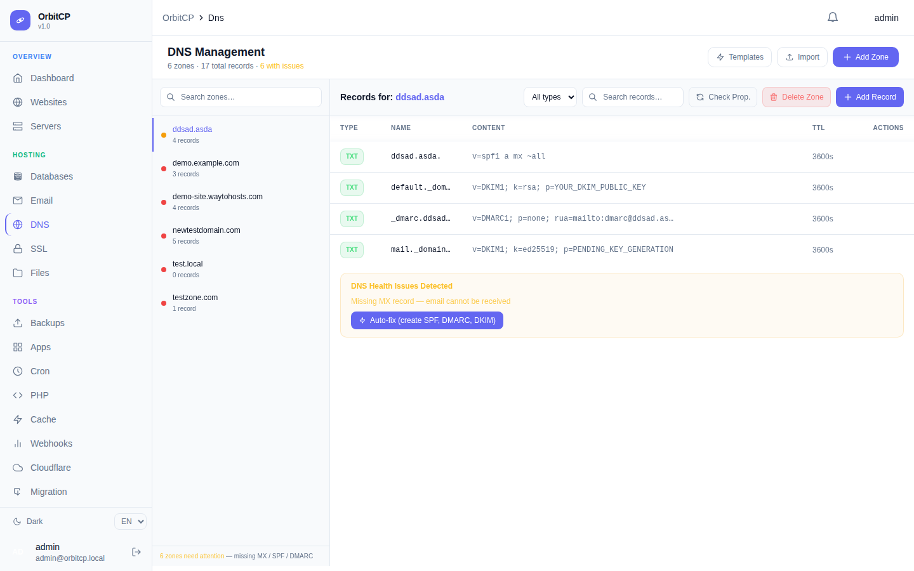
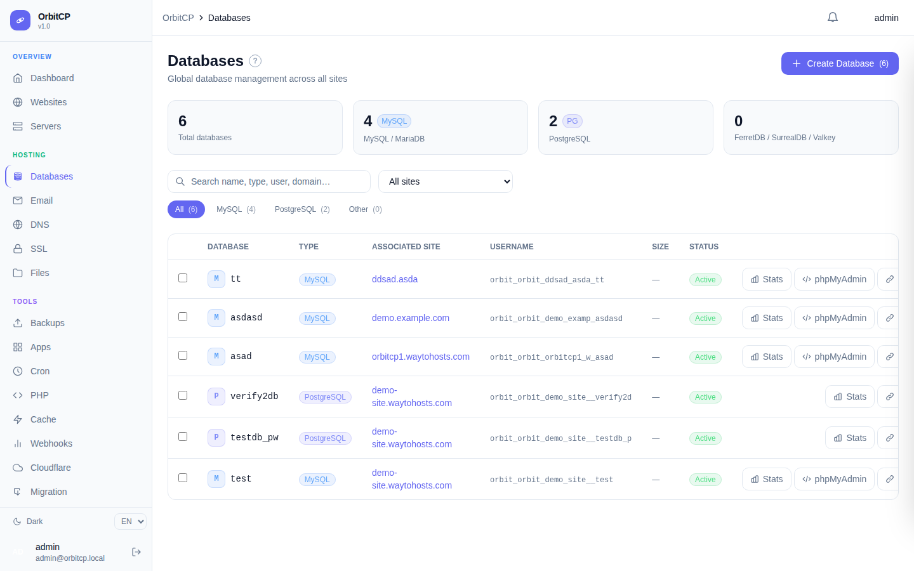
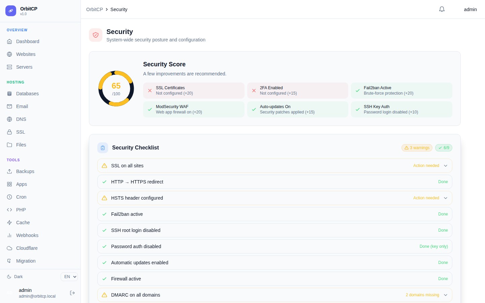

<div align="center">



# JottiCP

**Modern Rust-Powered Web Hosting Control Panel**

[](LICENSE)
[](https://dev-spb.ru/products/jottiecp)
[](https://dev-spb.ru/products/jottiecp)
[](https://dev-spb.ru/jottiecp/releases)
[](https://www.rust-lang.org)

[**🛒 Buy Lifetime License — $99.99**](https://dev-spb.ru/products/jottiecp) · [**📖 Docs**](https://dev-spb.ru/docs/jottiecp/) · [**💬 Support**](mailto:support@dev-spb.ru)

</div>

---

## 💡 Why JottiCP?

| | JottiCP | cPanel |
|---|---|---|
| **Price** | **$99.99 one-time** | $44.99–$264/mo |
| **Language** | Rust (memory-safe) | Perl/C (legacy) |
| **Sites** | Unlimited | Pay per account tier |
| **2FA** | Mandatory TOTP | Optional |
| **WHMCS module** | Free, included | Sold separately |
| **cPanel migration** | One-click importer | N/A |
| **API** | REST + CLI + MCP | WHM API only |

> cPanel costs **$539+ per year**. JottiCP is **$99.99 lifetime**. You save $439 in year one alone.

---

## 🆓 14-Day Money-Back Guarantee

Not satisfied for any reason? Get a **full refund within 14 days** — no questions asked.

[👉 Get JottiCP — $99.99 Lifetime](https://dev-spb.ru/products/jottiecp)

---

## ✨ Features

<table>
<tr><td>

### 🌐 Complete Hosting Stack
- nginx + Apache + OpenLiteSpeed
- PHP 7.4 → 8.4 per-site switching
- Node.js, Python runtime management
- MySQL, MariaDB, PostgreSQL databases
- Let's Encrypt SSL (auto-renew)

</td><td>

### 📧 Full Email Suite
- Postfix + Dovecot (SMTP/IMAP)
- Roundcube + SOGo webmail with SSO
- DKIM, SPF, DMARC management
- Forwarders, autoresponders
- Mailbox password management

</td></tr>
<tr><td>

### 🔒 Security First
- Mandatory TOTP 2FA
- ES256 JWT + JTI logout blocklist
- fail2ban (SSH, SMTP, IMAP)
- ModSecurity WAF + OWASP CRS
- nftables firewall management

</td><td>

### ⚡ Modern Architecture
- Rust/Axum backend (6 daemons)
- SvelteKit 5 PWA frontend
- PowerDNS with instant zone cache
- Valkey job queue (async provisioning)
- gRPC mTLS multi-server agent

</td></tr>
</table>

---

## 📸 Screenshots

<table>
<tr>
<td><br/><em>Dashboard</em></td>
<td><br/><em>Websites</em></td>
</tr>
<tr>
<td><br/><em>Email Management</em></td>
<td><br/><em>DNS Manager</em></td>
</tr>
<tr>
<td><br/><em>Database Manager</em></td>
<td><br/><em>Security</em></td>
</tr>
</table>

---

## ⚡ Quick Install (One Command)

```bash
curl -sSL https://dev-spb.ru/install.sh | sudo bash
```

Or with your domain:
```bash
curl -sSL https://dev-spb.ru/install.sh | sudo bash -s -- yourdomain.com
```

**Requirements:** Ubuntu 22.04/24.04 or Debian 11/12 · 1 GB RAM minimum · 20 GB disk

---

## 🔨 Build from Source

### Dependencies

| Package | Version |
|---|---|
| **Rust toolchain** | 1.80+ (`rustup`) |
| **Node.js** | 20 LTS |
| **npm** | 10+ |
| **PostgreSQL** | 15+ |
| **Redis / Valkey** | 7+ |

### NuGet / Cargo Dependencies

```toml
# orbit-panel/Cargo.toml (key crates)
axum = "0.8"              # HTTP framework
tokio = "1"               # Async runtime
sqlx = "0.8"              # Async PostgreSQL
serde = "1"               # Serialization
jsonwebtoken = "9"        # ES256 JWT
argon2 = "0.5"            # Password hashing
totp-rs = "5"             # TOTP 2FA
redis = "0.26"            # Valkey/Redis client
tonic = "0.12"            # gRPC (orbit-agent)
instant-acme = "0.7"      # Let's Encrypt
```

### Build Steps

```bash
git clone https://dev-spb.ru/jottiecp.git
cd jottiecp

# Copy and configure environment
cp orbit-panel/.env.example orbit-panel/.env
# Edit orbit-panel/.env with your database credentials

# Build all Rust daemons
cargo build --release --workspace

# Build SvelteKit frontend
cd orbit-ui && npm install && npm run build

# Run database migrations
cd orbit-panel && cargo run --release -- migrate

# Start services
./target/release/jotti-panel &
cd orbit-ui && node build/index.js &
```

---

## 🏗️ Architecture

```
HTTPS:443 → nginx → jotti-panel (127.0.0.1:2087)
                          │
          ┌───────────────┼───────────────┐
          ▼               ▼               ▼
    PostgreSQL 17    Valkey 8.1      orbit-dns
    (all state)      (cache+jobs)    (PowerDNS API)
                          │
                    gRPC mTLS :7443
                    orbit-agent (per server)
```

**Daemons:** `jotti-panel` · `jotti-agent` · `jotti-dns` · `jotti-mail` · `jotti-cron` · `jotti-cli`

---

## 💰 Pricing

| | Community | **Pro (Lifetime)** |
|---|---|---|
| **Price** | Free (AGPL) | **$99.99 one-time** |
| **Updates** | Self-managed | 1 year included |
| **Servers** | 1 | Unlimited |
| **Sites** | Unlimited | Unlimited |
| **Support** | GitHub Issues | Priority email |
| **White-label** | ❌ | ✅ |
| **WHMCS module** | ✅ | ✅ |

**[🛒 Buy Lifetime License — $99.99](https://dev-spb.ru/products/jottiecp)**

---

## 📞 Support

| Channel | Link |
|---|---|
| 🌐 Product page | [dev-spb.ru/products/jottiecp](https://dev-spb.ru/products/jottiecp) |
| 📖 Docs | [dev-spb.ru/docs/jottiecp/](https://dev-spb.ru/docs/jottiecp/) |
| 📧 Email | support@dev-spb.ru |
| 🐛 Issues | [GitHub Issues](https://github.com/DevelopmentSPB/jottiecp/issues) |

---

<div align="center">

Made by **[Development SPB](https://dev-spb.ru)** · Copyright © 2026

**[Lifetime License $99.99](https://dev-spb.ru/products/jottiecp)** · **[Docs](https://dev-spb.ru/docs/jottiecp/)** · **[Install](install.sh)**

</div>
